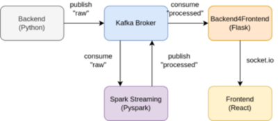

# Spark-Kafka-Streaming

## Architecture 



## Deployment Setup 

### Start 
```bash 
docker-compose up 
```
Open frontend on http://localhost:5000

### Detached Mode
```bash 
docker-compose up -d # start in detached mode
docker-compose down # stop all containers
```
### Health check 
```bash 
docker ps 

# You should see 5 containers
acaccef1b70a   kafka-spark-streaming-b4f         "python3 -m flask ru…"   3 minutes ago   Up 15 seconds             0.0.0.0:5000->5000/tcp, :::5000->5000/tcp   b4f
eb3d296e3511   kafka-spark-streaming-spark       "python3 spark.py"       3 minutes ago   Up 15 seconds                                                         spark
7379ec143bd0   kafka-spark-streaming-backend     "python3 backend.py"     3 minutes ago   Up 15 seconds                                                         backend
942dc7569d52   confluentinc/cp-kafka:7.0.1       "/etc/confluent/dock…"   3 minutes ago   Up 30 seconds (healthy)   0.0.0.0:9092->9092/tcp, :::9092->9092/tcp   broker
6eab82fedd86   confluentinc/cp-zookeeper:7.0.1   "/etc/confluent/dock…"   3 minutes ago   Up 54 seconds             2181/tcp, 2888/tcp, 3888/tcp                zookeeper

# restart all containers
docker-compose restart

# restart failed container e.g b4f
docker-compose restart -t 10 b4f
```

## Local Development Setup

### 0.Virtual environment
For development we can use a single virtual environment.
```bash 
python3 -m venv venv 
# repeat this step when you open a new terminal or configure the virtual environment in your IDE.
source venv/bin/activate

# to make sure the virtual environment is activated, check path of the python interpreter
which python
```
### 1.Kafka 
First start the kafka broker. Topics will be created automatically by the library.
```bash 
cd kafka 
docker-compose up -d

# check if everything is running
# it might take a couple of seconds
docker ps

# stop the broker once you are done
docker-compose down

# restart if a container crashes
docker-compose restart
```

### 2.Backend 
First start the backend to fetch data from an API.
```bash 
cd backend
pip3 install -r requirements.txt
python3 backend.py
```

### 3.Spark
Consumes the "raw" topic from the backend, and publishes to the "processed" topic.
```bash 
# might slighty differ on your machine (run "which java" to see the path)
export JAVA_HOME=/usr/lib/jvm/java-11-openjdk

pip3 install -r requirements.txt
python3 spark.py
```

### 4.Backend4Frontend
Create flask server to consume the "processed" data and host the react frontend on http://localhost:5000.
```bash
cd b4f
pip3 install -r requirements.txt

python3 app.py
```

### 5.Frontend
For development you can use "yarn start" to get auto-reloading. If you want to hosted version via b4f, you have to build the project.
```bash
cd b4f/fronend
yarn install

# during development
yarn start

# build to serve static files via b4f
yarn build
```